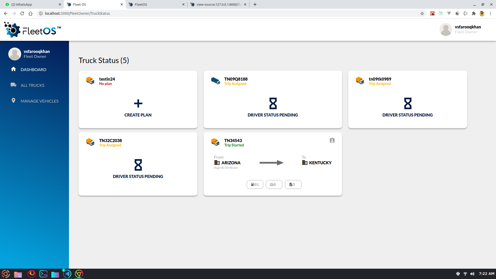
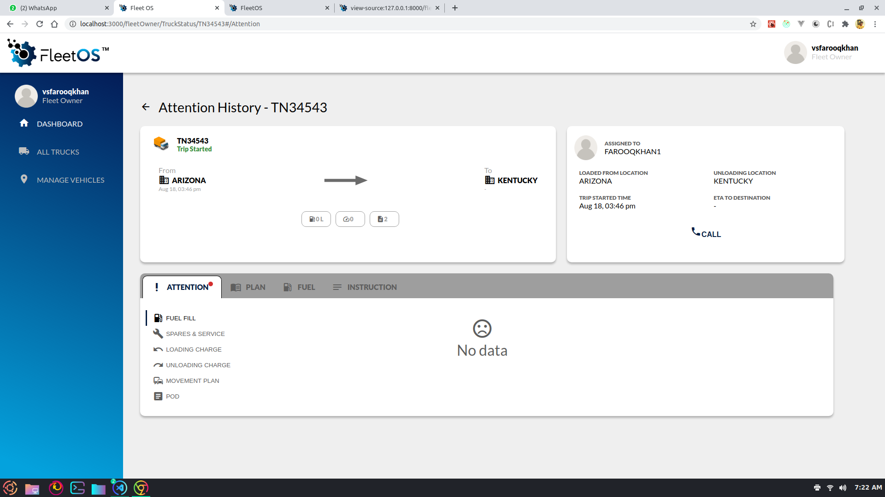

# Project Documentation

## Key Changes from v1
- No Jquery.
- No Bootstrap.
- Pure React Hooks, no class-based components.
- Heavily using React-Redux architecture.

## Folder structure
### ``components``
Contains all the components of the application.

### ``containers``
Contains all the pages of the application.

### ``config``
Contains all the configuration required for the application.

### ``context``
Contains all the global context API.

### ``hoc``
Contains all the higher order component used globally.

### ``hooks``
Contains all the Custom React Hooks of the application.

### ``scss``
Contains all the global SCSS Variables.

### ``utils``
Contains all the utility functions of the application.

### ``store``
Contains all Redux store.

## Completed Check list
1) Integrated component library
1) Simple Mobile login(experimental)
1) Truck Status
1) Attention History (only Plan, Fuel & Attention->PDO)

## Screenshots

